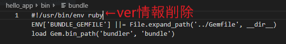

# herokuについて

>## herokuの流れ(ruby-5.3.6  bundle-2.0.2でうまくいった)
1. `bundle install --without production`
   - 困ったら`Gemfile.lock`を削除してbundleを再インストール
2. `heroku create`する
3. `git commit -a -m "[message]"`
4. `git push heroku master`

`git remote`で送り先があるか確認
>## herokuについての注意点
1. rubyのバージョンを変えたら`/bin/`配下のファイル群を見て回ること(例はbin/bundle)
  - rubyのバージョン情報が`2.5`のように現状と異なる場合がある。
  - そんなバージョン情報は削除しちゃえ
  
  

1. Gemfileにrubyやbundlerのヴァージョンを明記する必要なし（微妙）

1. `rbenv local`や`rbenv versions`で使おうとしてるrubyのヴァージョンが一致してるか確認

1. `heroku run ruby -v`としたとき、heroku側とローカル側でrubyのバージョンが異なるとき
   - `Gemfile`に`ruby 'localのversion'`を明記してpush

1. Gemfileを編集したら、Gemfile.lockを削除してから`bundle instal --without production`
   - 新しくできても追跡対象外となっていることがある。その時は`git add .` -> `git commit`
   - `Gemfile.lock`がVScode上できないときは、VSを再起動してみる。

1. もちろん、アプリ側の原因もあるので注意（メソッドの誤字など。。。）

1. ソースでデータベースのモデルを定義しているにも関わらず
   `heroku run rails db:migrate`してないとエラーになる。

1. ローカルホストで動くことを確認したからアップロードすること！

>## WindowsからMacへの環境移管
1. GemfileからWin関連のgemとGemfile.lockを削除し`bundle update`

2. app内に`vendor/bundle`と言うディレクトリができた場合にはこれを無視するよう`.gitignore`を編集

