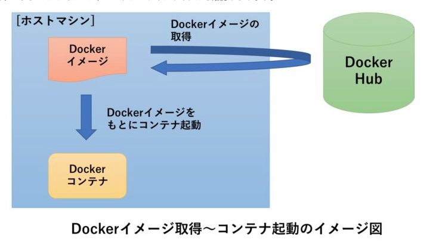

# Dockerの使い方

>## Dockerとは
1. Dockerとは
   - OS・ミドルウェア・ファイルシステム全体を`イメージ`という単位で取り扱い、まるごとやりとりできるツール
   - コンテナ型の仮想化環境を提供するプラットフォーム

2. Dockerの特徴
   - コンテナ型の超軽量サーバ仮想化製品
   - コンテナ内は実行環境として独立している
   - コンテナはリソース消費量が少ない
   - サーバやDBの初期設定を`docker-compose.yml`というyaml形式ファイルで設定できる
    

3. Dockerで何ができるか
   - ホストOS(win)の内部に独立したアプリケーションの実行環境＝コンテナを生成することができる
   - リソース消費量が少なく1台の物理サーバに多くのコンテナを稼働させられる

4. 仮想サーバ(VM)との違い
   - 物理マシンにできることは仮想サーバでもできる

5. Dockerの用語イメージ
   ```
    『DockerHub』・・業者用の倉庫
    『Dockerイメージ』・・冷凍チャーハン
    『Dokcerコンテナ』・・解凍して食べれる状態のチャーハン
    『Docker-compose』・・複数段あって温め順等を設定できる高機能な電子レンジ
    ```


>## 手順
1. `service docker start`でdocker daemonを起動
2. PowerShell/VMから`docker run -i -t centos /bin/bash`
3. docker-composeのbuildはsudoにて`sudo dokcker-compose build`
>## Redmineインストール時の動作確認
1. `http://192.168.33.10:8080`にアクセス

>## nginxインストール時の動作確認
1. `http://localhost:8080`にアクセス

>## VSCodeとの接続
1. VSCodeの拡張機能`Remote Development`をインストール

>## 用語集
- docker-compose: 複数のコンテナを同時にインストールしたり起動させたりするツール
- docker image: コンテナ実行に必要なファイルをまとめたファイルシステム
- 仮想化: １台の物理的なコンピュータの上で複数の仮想的なコンピュータを構築して実行する技術
  - `ハイパーバイザー型`と`コンテナ型`がある
    コンテナ型：物理的なコンピュータ状に乗ったホストOS(win)の上にDockerデーモンと呼ばれる制御プログラムが乗り、さらにそのDockerデーモンがアプリケーションコンテナをそれぞれ制御する仕組みとなる。
    
    

>## よく使うコマンド
- `docker ps`: 起動中のプロセスを表示
- `docker ps -a`: 停止中のプロセスも含め表示
- `docker images`: docker image一覧を表示
- `docker rm [プロセスID]`: プロセスの削除
- `docker rmi [image ID]`: imageの削除
- `docker build`: Dockerfileを基にimageを作成するコマンド

>## 参考
1. [Vagrant+Docker](http://tech-blog.rakus.co.jp/entry/20180618/vagrant/docker#Docker%E3%82%A4%E3%83%A1%E3%83%BC%E3%82%B8%E3%81%AE%E5%8F%96%E5%BE%97)
2. [DockerとVagrant比較](http://acchi-muite-hoi.hatenablog.com/entry/2016/05/30/041618)
3. [Docker composerの解説](https://coinbaby8.com/docker-beginner.html)
4. [Docker入門1](https://qiita.com/wMETAw/items/b9bc643ded4b92bf6add)
5. [Docker入門2](https://www.tech-training.jp/blog/entries/28)

>## docker for windowを用いる場合
1. `cd docker`
2. `docker-compose up -d --build`でビルドと立ち上げを行う
3. `winpty docker-compose exec web //bin/bash`としてコンテナに入る
    - `systemctl start memcached`
    - `cd /opt/enju-flower`(NDLサーチの場合)
    - `cd /opt/enju-management`(NDLサーチ管理の場合)
    - `bundle update`
    - `bundle install --path vendor/bundle`
    - `bundle exec rails s -p 3000 -b '0.0.0.0'`(ciscoつないでから)
    - `psql -h db -U catalog`
4. `psql -U postgres -d postgres`にてポスグレ
    - `\d`でテーブル一覧
    - `\x`で表示モード成形
   (pass: qfgdg233)
   [postgresqlの環境構築](https://qiita.com/wb773/items/c2fd0e1e0349a41b5844)
   - `\q`でログアウト
5. 検索クエリ等を`cookies`に保存させたい時は
   - `http://localhost.ndl.go.jp:3000/`環境にて検証すること
   - `C:\Windows\System32\drivers\etc`の`hosts`にホストを追記すること

6. databaseのdumpを行いたいとき
 https://github.com/laradock/laradock/issues/919

 下記はdocker-compose.ymlからの抜粋
```yml
   db:
    image: postgres:9
    container_name: db
    ports:
      - '5432:5432'
    volumes:
      - ./postgres:/var/lib/postgresql/data
    restart: always
    environment:
      POSTGRES_USER: catalog
      PGDATA: /tmp
```

>## DBとsolrをAWSインスタンスとした場合の接続手順
1. DBとsolrにssh接続するために、teratermマクロ(.ttl)を叩く
    - `C:\Program Files (x86)\teraterm\ttpmacro.exe`を実行
    - desktopにある`PortForward2pgsql.ttl`と`PortForward2solr.ttl`へ接続する
    - passphraseの代替として`.pem`ファイルを用いる:
      `C:\Users\tomohiko.miura\Desktop\pem\iss-mig.pem`
    - teraterm ターミナルを起動したままにしておく
2. dockerコンテナに入り、railsサーバを立ち上げる
    - git bashを立ち上げ目的のプロジェクトで`cd docker`
    - `docker-compose up -d --build`でビルドと立ち上げを行う
    - `winpty docker-compose exec web //bin/bash`としてコンテナに入る
      - `systemctl start memcached`
      - `cd /opt/enju-flower`(NDLサーチの場合)
      - `cd /opt/enju-management`(NDLサーチ管理の場合)
      - `bundle update`
      - `bundle install --path vendor/bundle`
      - `bundle exec rails s -p 3000 -b '0.0.0.0'`(ciscoつないでから)

## その他
1. `A server is already running.`と出たら
   - docker killする