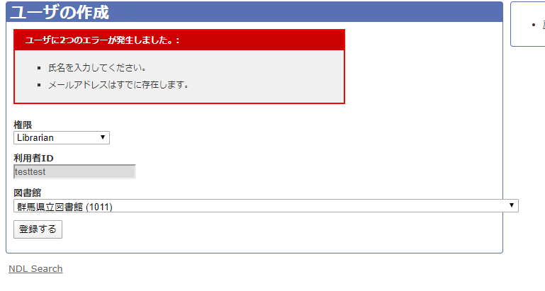

# タスク集

>## サーチフロント：ユーザ編集時バリデーションエラー起きる問題
```
E80000000
``

でログインすること。

ndl_application_helper.rbのprevious_or_registeredメソッドにて@attr[key]の方を返している


```
ID: E50000215
Pass: ndlndlndl1
```
- `http://localhost.ndl.go.jp:3000/`から行うこと
- ciscoつなぐこと

>## サーチフロント：利用者情報更新文字列
1. `http://localhost.ndl.go.jp:3000/`
   ```
    ID：E50003071
    PW：ndl12345
   ```
2. `config/environments/develop.rb`の`APPLICATION_HOSTS`を
   `APPLICATION_HOSTS = "ndl.go.jp"`とすること

3. app/helpers/ndl_application_helper.rbを修正すること。

>## サーチフロント：ndl_initializer設定解放
1. 右ペイン
   - 関連キーワード
   - 著者名キーワード(`author_keyword`)
   - 書評

2. `require 'enju_ndl/mobile/mobile_paginate_link_renderer'`コメントイン時エラーが発生
  - `Rack` gem
    - Rubyでwebサーバを立ち上げるためのインターフェィス
    - `config.ru`の設定必要？

>## 子どもOPAC: showのnextPageクリックで不適切な書誌詳細に行く問題
1. 「おはなしのろうそく」で検索
2. 一覧　-> 書誌詳細ページ
   - params[:list].split(";) = 
     [
     "http://localhost:3000/children/show/R100000002-I029329080-00", "http://localhost:3000/children/show/R100000001-`I073123229-00"--これがダメ`, "http://localhost:3000/children/show/R100000001-I061098835-00", ]
3. いちらんにもどる -> おはなしのろうそく31
   - params[:list].split(";) =
     ["http://localhost:3000/children/show/R100000002-I029329080-00", "http://localhost:3000/children/show/R100000002-`I024405670-00"--これが正しい`, "http://localhost:3000/children/show/R100000002-I000008926999-00", "http://localhost:3000/children/show/R100000002-I000007942070-00", "http://localhost:3000/children/show/R100000002-I000002865106-00"]

4. 検索時のparams
5. [:list]取得に問題あり
6. `app/views/children/show.html.erb`, l.17~
7. `app/controllers/children_controller.rb`, L.308~

- translated_params
[debug f]{:any=>"▒▒▒͂Ȃ▒▒̂낤▒▒▒▒", :sort=>"ud", :ar=>"4e1f"}
[debug j]{:sort=>"ud", :ar=>"4e1f", :any=>"▒▒▒͂Ȃ▒▒̂낤▒▒▒▒", :collection_code=>"(JIKAI OR JIBET OR JIHEI)"}


>## `unable to convert unpermitted parameters to hash`
1. 子どもページから検索かけたときに出るエラー
2. ストロングパラメタ仕様なのに送信がpermitされていない状態で`.to_hash`を用いてハッシュ化しているために出るエラー
3. 案
   `lib/enju_ndl/query_params_builder.rb` L.145
   ```ruby
   params = params.permit!.to_hash
   ```

   ```ruby
   # ストロングパラメータの対応を行う必要あり
   params.permit!
   params = params.to_hash
   ```
   
4. 公式
   [StrongParameters](https://railsguides.jp/action_controller_overview.html#strong-parameters)

5. お残しリストに言及あるはずなので書いておく 

>## 修正
1. showやsearch viewで([""])が入る問題
- m.titleなどに.to_s.gsub!(/\[\"+|\"\]/, "")を付け加える
- app/view/children/show.heml.erbの３０行目

2. 図書情報(タイトルとか)の照会先
   一覧(search.html.erb): solr(検索用API)
   書誌詳細(show.html.erb): DB(posgre)

3. 注意
   `Resource`モデルというモデル名がある(showのDB)

>## aasmのサーバ立ち上がらない問題
`model/resource.rb`の`:pending`部と`:rejected`部コメントインするとエラー
ログ
```
The scope body needs to be callable.
・・・
```
- aasm gemのバージョン上げたら直った

>## テストの手法
1. ホワイトテスト　C0テスト：命令文が全部実行されているか(if文も含め)

>## NDL検索機能のテスト
1. テスト要綱
   - 「すべての連携先を検索する」は確認しないで良し(横断検索タスクのため)
   - タイトルorキーワード:「教育」,出版地：「北海道」検索で統一

>## 検索結果一覧において著者の<em>タグがエスケープされちゃう問題
1. `app\views\books\_list_group_item.erb`(一覧表示画面), L.61側のhighlightメソッドで適切にhtml_safeされていない
2. `app\helpers\ndl_application_helper.rb`, L.978のtr_double_slashメソッドが原因？
3. `app\helpers\ndl_application_helper.rb`, L. に`highlight`メソッドあり

>## 書誌詳細検索マッチキーワードがハイライトされない問題
1. `app\views\books\show.html.erb`(L.70)から呼び出されるパーシャルである`app\views\books\_detail_content.html.erb`に関する問題
2. `_detail_content.html.erb`のL.16以降がハイライトされて欲しい箇所(chromeの検証機能よりid名照会)
3. `app\helpers\ndl_application_helper.rb`のhighlightメソッドは`keywords`がnullの時ハイライトしない
   -  `_detail_content.html.erb`の`highlight_keywords`がnullだった。(`<%= highlight_keywords %>`挿れてチェック)これが原因か
   -  `books_query`の方も空だった
   -  さらに親の`cookies[:books_query]`がそもそも空(`<%= cookies[:books_query].inspect %>`挿入で調査)ー＞これが原因

[流れ]
- 検索する
- 検索クエリが`cookies[:books_query]`に保存される(はず、 code不明)
- その内容を基に書誌詳細画面でキーワードハイライトを行う

- 環境の違いに起因するものだった

>## 障害者検索＞検索フォームが機能しない問題
- 「原本出版社ほか」、「製作者、所蔵館」フォームから検索実行した際、`一時的に利用できません`ページ(500エラー)にリダイレクトされる

下記は該当ログ
  ```
    172.18.0.1 - - [18/Nov/2019:05:13:53 UTC] "POST /books/search HTTP/1.1" 302 219
http://localhost.ndl.go.jp:3000/books?any=%22%22 -> /books/search

RSolr::Error::Http (RSolr::Error::Http - 400 Bad Request
Error: 'org.apache.solr.search.SyntaxError: Cannot parse \' ui_media_type_sm:8 (((publisher_morph_text:北海道^400 OR publisher_cjk_norm_text:北海道^20 OR publisher_cjk_text
:北海道^20 OR publisher_sm:北海道^500) [:repository_no_sm]:R100000049) OR digitized_publisher_sm:*北海道* OR library_sm:*北海道*)(access_right_sm:S01P99U99)\': Encountered
" "]" "] "" at line 1, column 158.
  ```
  - ` 'org.apache.solr.search.SyntaxError: Cannot parse \'`の`\'`は`'`を表示するためのエスケープシーケンスと思われる(\'～\'間で成立)
    - やはり`"]" "] "`がエラー原因か

1. `app\views\layouts\_books_query_form.html.erb`が検索フォームのパス
   - L.465以降が障害者検索のフォームか
2. `config\locales\enju_ndl_ja.yml`に検索フォーム名の定義あり
   - original_publisher: 原本出版者ほか
   - producer: 製作者、所蔵館
3. RSolrの設定ファイル：`vendor\bundle\ruby\2.6.0\gems\rsolr-2.2.1\lib\rsolr.rb`
4. 不要文字列(`"]`)が含まれていることによるエラー？
   - でもタイトルとかは含まれていても対応される

5. params[:medyatypes] = ["8"]をparams[:medyatypes] = nilとしたところ
   Error: 'org.apache.solr.search.SyntaxError: Cannot parse \' (((publisher_morph_text:北海道^400 OR publisher_cjk_norm_text:北海道^20 OR publisher_cjk_text:北海道^20 OR publi
sher_sm:北海道^500) [:repository_no_sm]:R100000049) OR digitized_publisher_sm:*北海道* OR library_sm:*北海道*)(access_right_sm:S01P99U99)\': Encountered " "]" "]"" at line
 1, column 139.
 - errorログからmediatype_sm: 8が消えた

6. `lib\enju_ndl\solr_search.rb` L.503の`add_word`メソッド(`lib\enju_ndl\ndl_solr.rb` L.40)への変数の渡し方の問題だった

>## NDLサーチ管理 TOP画面立ち上がらない
1. 旧環境での検証(TOP画面立ち上げまで)
     ```log
      Started GET "/admin/accounts/sign_in" for 10.0.2.2 at Mon Nov 25 03:25:17 +0000 2019
      Processing by Devise::SessionsController#new as HTML
      ### UUUUUU HTTP_X_FORWARDED_FOR= 10.0.2.2, LOGIN_SYSTEM=  UUUUUU
      Rendered devise/shared/_links.erb (0.9ms)
      Rendered page/_date_picker.html.erb (0.3ms)
      Rendered page/_header.html.erb (79.1ms)
      Rendered page/_menu.html.erb (0.6ms)
      Rendered page/_footer.html.erb (0.2ms)
      Rendered devise/sessions/new.html.erb within layouts/application (89.4ms)
      Completed 200 OK in 93ms (Views: 92.4ms | ActiveRecord: 36.8ms)
     ```
     - session処理はDevise gemで行っている
2. sessionが切れているためログインページにリダイレクト&ログイン処理
     ```log
      Started POST "/admin/accounts/sign_in" for 10.0.2.2 at Mon Nov 25 03:26:14 +0000 2019
      Processing by Devise::SessionsController#create as HTML
      Parameters: {"authenticity_token"=>"7Eg9i8QsdYvQJ6CO+0KVHHdeTIjki2z+o2Y4duonYAE=", "utf8"=>"?", "user"=>{"password"=>"[FILTERED]", "remember_me"=>"0", "email"=>"E00000001@sso.ndl.go.jp"}, "commit"=>"管理者ログイン"}
      Redirected to http://localhost/admin/admin/ndl_libraries
      Completed 302 Found in 13ms
     ```
3. ログイン成功後TOPページへリダイレクト
     ```log
      Started GET "/admin/admin/ndl_libraries" for 10.0.2.2 at Mon Nov 25 03:26:16 +0000 2019
      Processing by Admin::NdlLibrariesController#index as HTML
      ### UUUUUU HTTP_X_FORWARDED_FOR= 10.0.2.2, LOGIN_SYSTEM=  UUUUUU
      [debug](index用)---#<User id: 337, login: "E00000001", email: "E00000001@sso.ndl.go.jp", string: nil, encrypted_password: nil, created_at: "2017-05-19 05:36:21", updated_at: "2019-11-25 03:26:15", deleted_at: nil, password_salt: nil, persistence_token: "dummy", single_access_token: "dummy", perishable_token: "dummy", login_count: 0, integer: 0, failed_login_count: 0, last_request_at: nil, datetime: nil, last_login_at: nil, current_login_at: nil, last_login_ip: nil, current_login_ip: nil, library_id: 1, user_group_id: 1, reserves_count: 0, expired_at: nil, libraries_count: 0, bookmarks_count: 0, checkouts_count: 0, checkout_icalendar_token: nil, questions_count: 0, answers_count: 0, answer_feed_token: nil, due_date_reminder_days: 1, note: nil, share_bookmarks: false, save_search_history: false, save_checkout_history: false, required_role_id: 1, keyword_list: nil, user_number: nil, state: nil, required_score: 0, locale: nil, openid_identifier: nil, active: false, confirmed: false, approved: false, remember_token: nil, remember_created_at: nil, sign_in_count: 5, current_sign_in_at: "2019-11-25 03:26:15", last_sign_in_at: "2019-11-25 03:26:15", current_sign_in_ip: "::1", last_sign_in_ip: "::1", confirmation_token: nil, confirmed_at: "2011-01-28 00:00:00", confirmation_sent_at: "2011-01-28 00:00:00", reset_password_token: nil, ndl_library_id: nil, failed_attempts: 0, locked_at: nil>
      Rendered page/_date_picker.html.erb (0.3ms)
      Rendered page/_header.html.erb (2.3ms)
      Rendered page/_menu.html.erb (3.3ms)
      Rendered page/_footer.html.erb (0.1ms)
      Rendered vendor/plugins/enju_iss_search/app/views/admin/ndl_libraries/index.html.erb within layouts/application (97.8ms)
      Completed 200 OK in 127ms (Views: 100.9ms | ActiveRecord: 8.6ms)
     ```
     - topページの位置はvendor/plugins以下

4. devise依存の箇所多いため活用する方針で考える？(`current_user`はdeviseのhelper method)

- devise修正完了！下記ユーザ群からログインすること
  ```
    - 以下のコマンドで取り込んでください
    1.csvをdockerから見える場所に配置
    2.psqlコマンドでdbに接続
    3.catalog=# \copy users from 'users.csv' with csv
    4.catalog=# \copy roles_users from 'roles_users.csv' with csv

    # ログイン情報
    ## Administrator
    - ID:administrator@example.com
    - PW:ndl_aph_admin1

    ## Librarian
    - ID:librarian@example.com
    - PW:ndl_aph_admin1

    ## User
    - ID:user@example.com
    - PW:ndl_aph_admin1

    ## Guest
    - ID:guest@example.com
    - PW:ndl_aph_admin1
  ```

>## ユーザ関連
- 検証は`test_ishikawa` でやると良い

1. ユーザ一覧 -> ユーザ詳細 -> 編集 -> 更新ボタン押下時(`Adminユーザ編集の時`, それ以外はエラー)
   `ActiveModel::ForbiddenAttributesError`が出る
   - `user_controller.rb`のL.88に`.permit!`メソッドを加えた
      ```ruby
        if @user.update_attributes(params[:user].permit!)
      ```
   - StrongParameterにより勝手にパラメタ値を編集できないようになっているため、このエラーが発生した。

{"utf8"=>"✓",
 "authenticity_token"=>"Hugk6RbA6ZnVw0tdL6/v2bLelVc3OgO5BNqGMZuLZ0JMAueLw7lOEsuh3KonNz7A0F1GDoVqK8u5GP1jqHnfwA==",
 "user"=>{"role_id"=>"2", "setting_attributes"=>{"name"=>"あああaa", "prefecture_id"=>""}, "email"=>"E00000001@sso.ndl.go.jp", "password"=>"[FILTERED]", "password_confirmation"=>"[FILTERED]"},
 "commit"=>"登録する"}

 2. ユーザの新規作成字も`ActiveModel::ForbiddenAttributesError`が出る
    `user_controller.rb`のL.64-65に`.permit!`メソッド加えるべき(createメソッド)
    @user.ndl_libraryはユーザに紐づく図書館を表す

>## DBのマイグレーション
`bundle exec rails db:migrate`を実行せよ

>## DEPRECATED WARNINGログの修正
1. `config/environments/development.rb`において
   `config.active_support.deprecation = :log`を
   `config.active_support.deprecation = :silence`にする
or
2. public配下のJS類をasset pipelineで動かす。

>## scope構文修正
- app\models\resource.rbにおいてL.14下を下記リプレイス

```ruby
default_scope -> { order(updated_at: 'DESC') }
  scope :approved, lambda {|from_time, until_time| { where(['updated_at >= ? AND updated_at <= ? AND state = ?', from_time, until_time, 'approved']) }
  scope :not_approved, lambda {|from_time, until_time| { where(['updated_at >= ? AND updated_at <= ? AND state = ?', from_time, until_time, 'not_approved']) }
  scope :published, lambda {|from_time, until_time| { where(['updated_at >= ? AND updated_at <= ? AND state = ?', from_time, until_time, 'published']) }
  scope :all_record, lambda {|from_time, until_time| { where(['updated_at >= ? AND updated_at <= ?', from_time, until_time]) }
  # NDLではdeletedの条件を修正
  scope :not_deleted, -> { where(['deleted_at IS NULL OR state != ?', 'published']) }
  scope :deleted, -> { where(['deleted_at IS NOT NULL AND state = ?', 'published']) }
  validates_presence_of :iss_token, :dcndl_xml
  validates_uniqueness_of :iss_token
```

>## Librarian権限のユーザ作成時validation errorが表示される問題
1. ユーザ作成時にLibrarian権限のユーザを作成しようとしても校正にひっかかる
2. `apps/models/user.rb`に`set_librarian`メソッドがあるがこれがうまく作用してない？（ダミーのemailとpassword設定する箇所ある）


3. `利用者ID`を重複させて登録した場合`メールアドレスはすでに存在します。`エラーに引っかかる

>## サーチ管理
http://www2.btc-kamitsure.com/admin/accounts/sign_in

>## 震災管理
email: ndlsearch-aph1@example.com
pass: ndl_aph_example

http://eq.btc-kamitsure.com/accounts/sign_in
