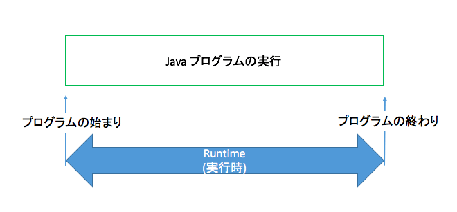

# 雑記メモ

>## 環境構築の流れ
1. VirtualBox + Vagrantで仮想マシンを作り、これをメインの環境とする(gitとかも)
2. [Qiita記事](https://qiita.com/balmychan/items/7220b635f7dcd06eb6e5)を参考にツール群をインストール
3. gitの設定
4. teratermの設定(solarized, Myricaフォント)
5. PowerShellでvimを扱えるようにする([Qiita記事](https://qiita.com/shuhoyo/items/d9966e12976275f20c24))

>## 用語等
1. `native extensions`
   - gemの中には、ruby以外の言語に依存しているものもあり、
     そのような依存関係のあるものをインストールする場合`with native extensions`と表示
   - nativeとはCやC++で書かれたライブラリのこと
2. `E2Eテスト(End to End test)`: 結合テストのこと
   - 単体テストとは違いシステム全体を実稼働時に近い状態でブラウザの操作をしなっがらテストをする。
3. オーバーヘッド: コンピュータが何かやった時に発生する、付加的な処理(負荷)のこと
4. ubuntuやほかのオープンソースのlinuxは、必要なプログラムやソフトをインターネット上のサーバにおいて公開している。
そのサーバのことを`レポジトリ`と呼ぶ。インストール段階では、レポジトリの場所は海外に設定されている。これを日本にすればソフトのダウンロードが早くなる。
5. `runtime`: プログラムの実行時のこと
   

>## その他
1. VSCode等のターミナルで`code [ファイル名]`入力でファイルをVSCで開ける

>## Python
### Automate the boring stuff with Python
1. Chap 6, P.135: `コピーアンドペースト`
   *Copying and Pasting Strings with the pyperclip Module
The pyperclip module has copy() and paste() functions that can send text
to and receive text from your computer’s clipboard. Sending the output of
your program to the clipboard will make it easy to paste it to an email, word
processor, or some other software.
Pyperclip does not come with Python. To install it, follow the directions
for installing third-party modules in Appendix A. After installing the
pyperclip module, enter the following into the interactive shell:
  ```python
  >>> import pyperclip
  >>> pyperclip.copy('Hello world!')
  >>> pyperclip.paste()
  'Hello world!'
  ```
Of course, if something outside of your program changes the clipboard
contents, the paste() function will return it. For example, if I copied this
sentence to the clipboard and then called paste(), it would look like this:
>>> pyperclip.paste()
'For example, if I copied this sentence to the clipboard and then called
paste(), it would look like this:**

2. Chap6, P.133: `テキスト成形プログラム`

3. Chap6, P.138: `batファイルからの実行について`
  下記手順で代用(pathが通っている場合)
   1. terminalで`cd ~/Desktop/PythonProjectsBTTC/AutomateWithPython`
   2. `python pw.py email` (pw.pyが第一引数、emailが第二引数)
  [参考リンク](https://ishii-akihiro.hatenablog.com/entry/2018/08/01/155536)

4. Chap6, P.139: `MarkDownにも使える`
   - clipboardに成形したいテキストをコピーしたまま`python bulletPointAdder.py`
   - markdownファイルに貼り付けたら成形されてる

5. Chap7, P.152: `正規表現の使い方`
  ```
    Review of Regular Expression Matching
  While there are several steps to using regular expressions in Python, each
  step is fairly simple.
  1. Import the regex module with import re.
  2. Create a Regex object with the re.compile() function. (Remember to use a
  raw string.)
  3. Pass the string you want to search into the Regex object’s search() method.
  This returns a Match object.
  4. Call the Match object’s group() method to return a string of the actual
  matched text.
  ```

  - optional: `無くてもよい`的なニュアンス
  - `?`には２つの意味があるので混同しないように(declaring a nongreedy match or flagging an optional group.)

6. `Carrots(^) cost dollars($)` to remind myself that the caret comes first and
the dollar sign comes last.

7. Review of Regex Symbols
- The ? matches zero or one of the preceding group.
- The * matches zero or more of the preceding group.
- The + matches one or more of the preceding group.
- The {n} matches exactly n of the preceding group.
- The {n,} matches n or more of the preceding group.
- The {,m} matches 0 to m of the preceding group.
- The {n,m} matches at least n and at most m of the preceding group.
- {n,m}? or *? or +? performs a nongreedy match of the preceding group.
- ^spam means the string must begin with spam.
- spam$ means the string must end with spam.
- The . matches any character, except newline characters.
- \d, \w, and \s match a digit, word, or space character, respectively.
- \D, \W, and \S match anything except a digit, word, or space character respectively.
- [abc] matches any character between the brackets (such as a, b, or c).
- [^abc] matches any character that isn’t between the brackets.

