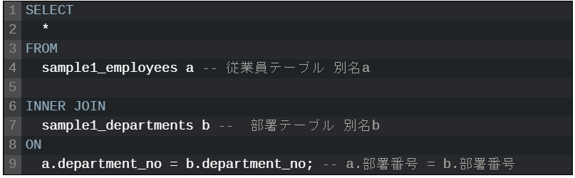

# VIEWの作成

1. テーブル間で抽出したい項目をピックアップ(`データ項目対照表.xslx`)
  - 3	アクワイアラID()
  - 4	加盟店コード(MERCHANT_CD, M_SUICA_STORE	, SET_~より)
  - 5	設置店枝番(STORE_BRANCH_NO, STORE_BRANCH_NO, SET_~より)
  - 6	端末枝番(TERMINAL_BRANCH_NO, , SET_~より)
  - 7	ブランドコード()

2. 例についての解釈
   - adr(address):住所テーブル
   - ent(enterprise):事業者テーブル
   - mer(merchant):加盟店テーブル
   -  FROM   etl_enterprises ent  :etl_enterprisesをentと以後呼称するの意

3. 技術関連
   - FROM a b構文
    

4. OracleDBへの接続
- oracleDB `extconf.rb`, `oraconf.rb`へのパス：
`C:\jruby-9.2.8.0\lib\ruby\gems\shared\gems\ruby-oci8-2.2.7\ext\oci8`

- 環境パスの設定
```bash
$ LD_LIBRARY_PATH=/c/Users/tomohiko.miura/Desktop/OracleDB
$ export LD_LIBRARY_PATH
```

- プロジェクトのパスへ移動
```bash
$ cd Desktop/OracleDB/etl_tbo_payment_ruby
```

>## 業務の流れ
1. viewを作成したらbacklogの
   ファイル→04.詳細設計→DB物理設計→決済-ETL View定義
   の各ファイルをリプレース
2. slackで森田さん・三神さん・山岸さんにメンション

5. View;QP
[QP店舗(store),加盟店(merchant)]
- 1 加盟店コード(MERCHANT_CD, etl_merchants)
- 2 設置店枝番(STORE_BRANCH_NO, etl_stores)
- 6 半角カナ屋号(TRADE_NAME_KANA, etl_stores)
- 7 漢字屋号(TRADE_NAME_JP, etl_stores)

from句のmerchant_cdの部分どうしよう

>## フィードバック1010
1. QPのview定義
   - ER図　情報連携 物理設計ph1
   - ETLと名付くところはproccecing_idを必ず含む（er図）
   - ETLは主キー大事
   - legacy同氏結合することはありえない
   - str.merchat_id = qp_mer.merchant_id でよかった
   - 主キー同士を結合条件にすべき
   - ->enterprise_idとmerchant_id同士はほぼ結合条件になる
   - 主キー関連はほぼ結合条件に入る
   - ブランドテーブルに住所が入っている場合など、inner joinするとやばい->DB定義書でnull許可のカラムは、inner joinせずleft joinする