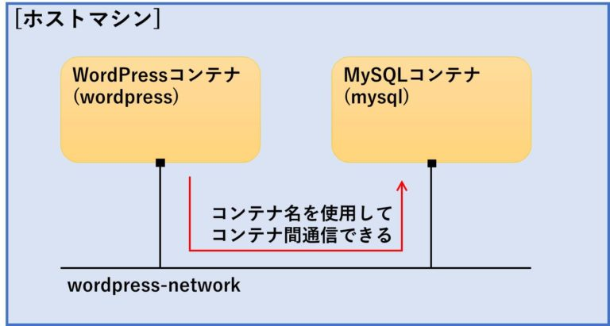

# 使用技術

>## インフラ関連技術

>### AWS Lambda
```
  AWSに関するなにかしらのイベントによって処理を実行する環境のこと
  その処理はユーザが作成する(多言語対応)
```

例）
- S3にファイルアップしたときにプログラムを実行
- S3からファイルを削除したときにプログラムを実行
- APIサーバとして、クライアントから通信を受けたらプログラムを実行
  イベント→処理

（参考）[Qiita記事](https://qiita.com/s_s_k/items/b584435120e99d63975b)

>### AWS SES(Simple Email Service)
```
  メーラーサービス
```
使わないかも

>### AWS Step Functions
```
  いくつかのステップに分かれる処理をLambdaで構築するときに、処理のステート管理や処理間のコーディネートを行ってくれるサービスのこと
```
- 従来は、このような処理を組もうとすると`本来行いたい処理に関するコード以外に状態を管理するコード（フラグなど）`を書く必要があったが、Step Funtionsを用いることで、疎結合でメンテしやすいバッチ処理を作ることができる。

（参考）[Qiita記事](https://qiita.com/ketancho/items/147a141c9f8a6de86c97)

>### Amazon API Gateway
```
  クライアントから受け取ったリクエストを、それぞれのマイクロサービスにルーティングする仕組みのこと
```
- 通常のマイクロサービスアーキテクチャの場合、クライアントとそれぞれのAPIは、個別に通信を行う。例えば、1つのWebサービスに「決済サービス」や「ショッピングカート」、「メール機能」、「レコメンド機能」といった複数のAPIが使われていた場合、それぞれのAPIと個別に通信が発生することになる。
- 一方、API Gatewayの場合、クライアントはすべてのAPIへのリクエストをAPI Gatewayへの通信として行い、それを窓口として、「決済サービス」や「ショッピングカート」といった個々のAPIとの通信が行われる。このため、クライアントが通信を行うのはAPI GatewayのAPIのみとなる。

（参考）[RakutenRapidAPI](https://blog.api.rakuten.net/jp-api-gateway/)

>### AWS Cloud Front
```
  AWSが提供するCDN(Contents Delivery Network)のこと
```

>### Docker
```
  LXC(OSの仮想化技術の一つでVMに比べ軽量)ユーティリティのこと
  Dockerは軽量な仮想マシンを簡単に構築することができ、インフラを含めたアプリ全体をまるまる、コンテナという箱に閉じ込めることができる。
```

1. Dockerの特徴
- OS・ミドルウェア・ファイルシステム全体を`イメージ`という単位で取り扱い、まるごとやりとりできる。
- 仮想環境は`コンテナ型`と呼ばれ、ホストOSに直接アクセスしている。
- ホストOSからはコンテナは１プロセスとして認識される。


（参考）[Qiita記事](https://qiita.com/inexp_eng4432/items/96deef2ece54dc73827c)

2. Docker Network
- コンテナ間で行う通信のこと
  

(参考)[さくらナレッジ](https://knowledge.sakura.ad.jp/16082/)

3. Docker Compose
 ```
  複数のコンテナから成るサービスを構築・実行する手順を自動化し、管理を容易にする機能。単一のコマンドで複数のコンテナを一度に起動できる。
 ```

- 設定ファイルはapplicationのディレクトリ内にある`docker-compose.yml`
- runコマンド
  ```bash
    # コンテナを作成してコマンド実行(実行後コンテナを削除)
    docker-compose run --rm ${service_name} ${command}
  ```
1. 注意
- Docker環境ではLinux用のソフトやファイルを運用すること(win用はだめ！)
- nginxサーバには`localhost:80`で接続
- docker console内で`docker`コマンドは実行できない！(当たり前)

(参考)[さくらナレッジ](https://www.ogis-ri.co.jp/otc/hiroba/technical/docker/part4.html)

>### Oracle DataBase
1. View: テーブルを整形するためのオブジェクト。テーブルのようにデータを保持しているわけではない疑似データベース
  - Oracleのビューはテーブルのように扱える
  - ビューはデータを保持していない
  - 使用頻度が高い＆複雑で長いSQLであればビューを検討してみる
  `ビューは実テーブルをどのように見るのかを定義したもの`

2. `curl -O [URL]`でファイルをダウンロードできる

