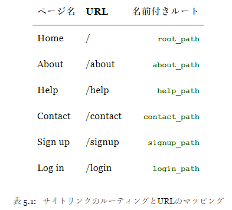
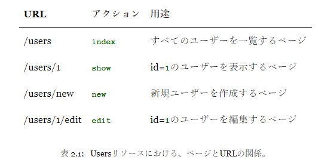
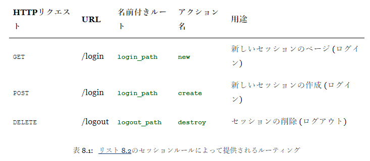
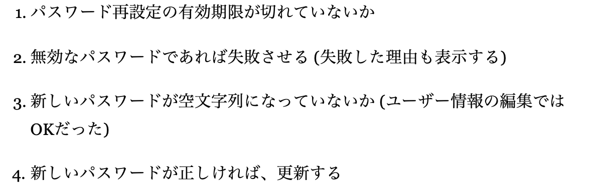
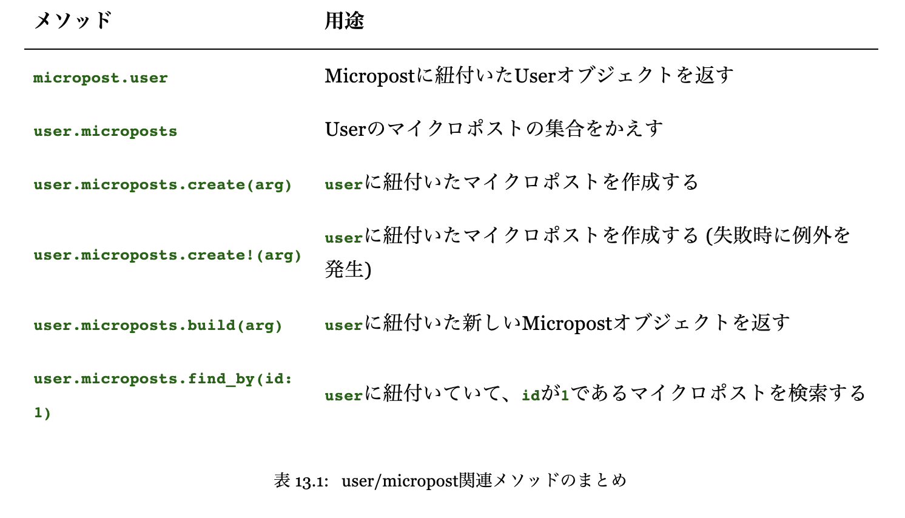
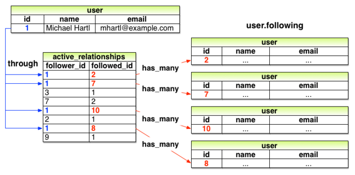

- 章別のメモ、分からない点など

>## chapter 1(7/20-7/23)(8/3)
1. MVCの構造
> Railsアプリと通信する際、ブラウザはWebサーバーにrequestを送信し、
> これはrequestを処理する役割を担っているRailsのcontrollerに渡されます。
> controllerは、場合によってはすぐにviewを生成してHTMLをブラウザに送り返します。
> 動的なサイトでは、一般にcontrollerは (ユーザーなどの) サイトの要素を表しており、
> データベースとの通信を担当しているRubyのオブジェクトであるmodelと対話します。
> modelを呼び出した後、controllerは、viewを描画し、完成したWebページをHTMLとしてブラウザに返します。


[まとめ]
- ブラウザからのrequestはコントローラに渡される
- コントローラはビューを生成する。また、モデルと対話して、後にHTMLとしてビューを返す
-
2. git
> Gitにプロジェクトのファイルをaddすると、最初はStaging)という一種の待機用リポジトリに置かれ、
> コミットを待ちます。安全のため、いきなりコミットしないようになっているのです。
> ステージングの状態を知るにはstatusコマンドを使います。

- `git commmit -a -m`について
> git add -Aを実行することもできますが、git commitには現存するすべてのファイルへの変更を一括でコミットする-aフラグがあります。このフラグは非常によく使われます。
- `git chekout -f`: git commitしていないとき、ファイルを元に戻す

- ブランチは基本的にはリポジトリのコピーで、ブランチ上では元のファイルを触らずに新しいコードを書くなど、自由に変更や実験を試すことができます。
  通常、親リポジトリはmasterブランチと呼ばれ、トピックブランチ (短期間だけ使う一時的なブランチ) はcheckoutと-bフラグを使って作成できます。

- 便利なシェルコマンド
-- `ll app/controllers/*_controller.rb`

- `heroku run rails console`
- `heroku run ruby -v`

(ruby-2.6.3, rails-5.2.0 bundler-2.0.2が現状ロバスト)

3. 「シェル」とは、実際に動くコマンドやプログラムに「かぶさっている」インターフェイスと考える

4. bundler: アプリケーションに必要なgem群をインストールする
5. `rails s`は別のターミナルから実行すると便利
6. ルータはブラウザとコントローラの間に配置され、ブラウザからのリクエストをコントローラに振り分ける
7. 本番用のgem (この場合はpg gem) をローカルの環境にインストールしないようにするため:`bundle install --without production`

>## Chapter2(7/23,24)(8/3)
1. @users=User.allで@usersには、Userテーブルのレコードが一つ一つ配列して入ることになる。

2. REST(REprental State Transfer)
  >インターネットそのものやWebアプリケーションなどの、分散・ネットワーク化されたシステムや
  >アプリケーションを構築するためのアーキテクチャのスタイルの1つ
  >RailsアプリケーションにおけるRESTとは、アプリケーションを構成するコンポーネント
  >(ユーザーやマイクロポストなど) を`リソース`としてモデル化することを指します。
  >これらのリソースは、リレーショナルデータベースの作成/取得/更新/削除 (Create/Read/Update/Delete: CRUD) 操作と、
  >4つの基本的なHTTP requestメソッド (POST/GET/PATCH/DELETE) の両方に対応しています。

3. `routers.rb`の`resources`
   - 基本的な7つのアクションとそれに対するルーティングを自動で与える

4. `heroku run rails db:migrate`
   - アプリにデータベースをマイグレートしたらherokuでも

5. Userリソースのルーティング
   

6. MVCアーキテクチャ詳解
   

7. レンダリング: html等を生成すること

8. コントローラで宣言したインスタンス変数はビューで取り扱える

9.  `Ctrl + d`でもコンソール閉じれる！

>## Chapter3(7/24)(8/3)
1. gemfileには必ずrubyとそのバージョンを明記する
   - `heroku run ruby -v`をすれば分かるが、デフォルトでheroku側のrubyのバージョンとこちらのrubyのバージョンが異なっている
   - エラー出たらログちゃんと読もう（gemにbootsnap入ってないよとか）

2. HTTP methodについて
>HTTP (HyperText Transfer Protocol) には4つの基本的な操作があり、
>それぞれGET、POST、PATCH、DELETEという4つの動詞に対応づけられています。

3. routers.rb
- root "con.#act."は`"/" -> "con.#act."`の略記形
- get "con./act" -> "con.#act."のとき`get "con./act."`と略記できる。

4. `bundle update`: Gemfileに記載されてるgemと異なるバージョンのgemがすでにインストールされている場合に実行
   -> gemのバージョンを合わせる

5. 作ったばかりのrails（デフォルトのアプリ）はheroku上ではうまく表示されないので、hello worldあたり書いておく

6. コントローラ：Webページをまとめたコンテナ

7. .gitignoreはGitの設定ファイルの１つで、ここで指定されたファイルはGitリポジトリに追加されなくなります。

8. `bundle exec guard`テストを自動化してくれる（差分のみテストなど）

[以下はテストについて]
9. TDD(Test-Driven Development): 最初に正しいコードがないと失敗するテストを書き、次に本編のコードをそのテストを通過するよう書くこと
10. 統合テスト：ユーザーがWebブラウザでアプリケーションとやりとりする操作をシミュレートできる
11. `assert_select`: 特定のHTMLタグが存在するかどうかをチェック
12. `setup`: 各テスト実行される直前に自動的に呼び出されるメソッド
13. `assert_response`: Getメソッドで200 OKを出すかチェック
14. `assert_template`: 適切なテンプレートが選択されているかチェック
15. `assert_equal <期待される値>, <実際の値>`
16. `assert_not`: falseかどうかチェック
17. `assert_difference`: countの値が変わっていることをチェック
18. `assert_no_difference`: countの値が変わっていないことをチェック
19. `follow_redirect!`: POSTリクエストを送信した結果を見て、指定したリダイレクト先に移動するメソッド。
20. `assigns`: コントローラで定義したインスタンス変数にテスト内部からアクセスするメソッド
    - `@user`には`assigns(:user)`
>## Chapter4(7/24,25)(8/4)
1. hash
  次の二つは等価
  メソッド呼び出しの丸カッコは省略可能。
  ```ruby
  stylesheet_link_tag('application', { media: 'all',
                                 'data-turbolinks-track': 'reload' })
  stylesheet_link_tag 'application', media: 'all',
                                 'data-turbolinks-track': 'reload'
  ```
2. カスタムヘルパー：組み込みメソッド以外で新しく作ったメソッド

3. シングルクォート：特殊文字をエスケープせずそのまま保持してくれる
4. `オブジェクト`：メソッドに応答するもの
5. rubyでオブジェクトそのもの論理値がfalseになるのは`false`と`nil`のみ
6. メソッドの引数は省略可（括弧も）->ただしデフォルト値があるメソッドのみ
7. `module`:関連したメソッドをまとめる方法の一つ->includeで読み込む（ただしrailsの場合自動でヘルパーメソッドを読み込む）
8. `(0..9).to_a`で0から9までの配列
9. `map`: `each`の処理に加えて新しい配列をつくる
10. `test`ブロックメソッド:
    ```ruby
    test "should get home" do
      get static_pages_home_url
      assert_response :success
      assert_select "title", "Ruby on Rails Tutorial Sample App"
    end
    ```
    ->`test`は説明文を第一引数に、ブロックを第二引数に取る！
11. 引数が配列のメソッドを定義するときは
    ```ruby
    def method(s)
    end
    ```
    のようにする！
12. ハッシュ: user["Key"] = "Value" 　波括弧{}で記述する点も注意
13. ハッシュの３通りの表記方法
    ```ruby
    user = { "first_name" => "Michael", "last_name" => "Hartl" }
    user = { first_name: "Michael", last_name: "Hartl" } #JSっぽい
    user = { :first_name => "Michael", :last_name => "Hartl" }　
    ```
14. `シンボル`: 文字列を整数化したもの。''ではなく:をつける
15. `クラス`: メソッjjドをまとめる。インスタンスが生成されることで実際のオブジェクトができる。
16. `クラスインスタンス`: newメソッドなど、クラスに対して呼び出されるメソッドのこと
17. `範囲オブジェクト`: `1..10`のような形のオブジェクトのこと
18. Railsのアクションには戻り値がない

>## Chapter5(7/25)(8/5)
1. 名前付きルートパスの設定
  `get 'static_pages/help'` -> `get  '/help', to: 'static_pages#help'`とすれば
  > help_path -> '/help'
  > help_url  -> 'http://www.example.com/help'
  という結果が得られる。
  
  - フルパスはリダイレクトの場合のみ使う(HTTPはリダイレクトのときフルURLを要求する)
  - `as:`オプションで名前変えられる
2. bootstrapにおいて特別な意味をもつクラス名：
   `navbar`, `navbar-nav`, `navbar-right`, `container`, `btn`, `btn primary`, `jumbotron`, `col-md-4`
3. `nav`:その内側がナビゲーションリンクであることを明示
4. `curl`コマンド便利
5. `アセットパイプライン`: css, js, imageファイルの読み込みを高速化
   - 全てのcssファイルを`application.css`に、すべてのjsファイルを`application.js`にまとめてくれる
   [３つの標準ディレクトリ(アセットディレクトリ)]
   - app/assets: 現在のアプリケーション固有のアセット
   - lib/assets: あなたの開発チームによって作成されたライブラリ用のアセット
   - vendor/assets: サードパーティのアセット
  ->最適配置はsprocketというgemが行う
  -> プリプロセッサエンジン
6. `bootstrap`の導入。
   - `app/assets/stylesheets/`直下に`.scss`ファイルを作る
   ```ruby
    @import "bootstrap-sprockets";
    @import "bootstrap";
   ```
   のようにインポートして取り入れる（クラス名さえ対応してれば即導入完了）
7. railsは`.scss`ファイルを自動的に`.css`に変換して処理
8. #logoの:hoverは
   ```scss
    #logo {
      &:hover
    }
    }
    ```
    のように書く！
9. `統合テスト`: リンクのクリックなど一連の作業テスト
   - レイアウトの各リンクが正しいかどうか
   - ブラウザによるページ間の遷移を効率的にシミュレートする

>## Chapter6(7/25,26)(8/6)
1. コントローラ名には複数形を用い、モデル名には単数形を用いる。
2. モデルのインスタンスはレコード！
3. callback method: ある特定の時点で呼び出されるメソッド(before_actionなどで)
4. index: 多数のデータが存在するときの検索効率を向上させる要素。本の索引のイメージ
   - これがないと表全てを順にスキャンして探すことになり非効率（本からキーワード１ページ目から探す？）
   - fixtureファイル適切にしないとテスト通らない
5. モデル：データモデルとして扱うデフォルトのデータ構造のこと
6. Active Record:データベースとやり取りするrailsのライブラリ
   - データオブジェクトの作成・保存・検索などのメソッドを持つ
7. User.newは.saveしてない限りメモリ上にオブジェクトを作成するだけ
8. `.update_attributes`:　属性からデータを更新・保存するメソッド
9.  validationはTDDと合う
10. 次の２つは等価：
  ```ruby
    validates :name, presence: true
  ```
  ```ruby
    validates(:name, presence: true)
  ```
11. `rails c`に設定反映されてないときは再起動
12. fixture: サンプルデータが含まれるファイルのこと
13. [ハッシュ化パスワードによる認証]
    - 認証画面から送信されたパスをハッシュ化
    - DB内のハッシュ化されたパスと比較してtrueだったら認証
    - ハッシュ化されたパス同士を比較
14. `digest`の語源：暗号化用ハッシュ関数が語源
15. `.authenticate()`:引数のパス（送信されたパス）とDB内のパス（のハッシュ）を比較
    - 返り値はレコード
16. 頭に`!!`をつけると強制的に論理値)(true or false)になる！
17. herokuへのDBマイグレートが上手くいったかどうかは
    `heroku run rails console --sandbox`でチェック

>## Chapter7(7/26)(8/6,8/7)
1. `routers.rb`に`resources :[controller名]`を付与することで
   基本機能に対するURLがすべて付与される。
   
2. debugが終わったらdebuggerメソッドは削除--paramsの値も見れて便利
3. `form_for`: Userモデルのオブジェクト（レコード, @user）を取り込み、
   そのレコードの属性(nameとか attributesのこと)を使ってフォームを構築する。
   - `すべてのRubyオブジェクトは自分のクラスを知っている`
4. railsはnameプロパティの値を使って、初期化したハッシュを、params変数経由で構成する。
5. `user_params`という外部メソッドを`params[:user]`の代わりに使う -> Strong Parameters
6. `redirect_to @user` = `redirect_to user_url(@user)`
7. `puma.rb`はデフォルトを全消しして、チュートリアルのやつに置き換えればok
8. Railsには`Rails`というオブジェクトがあり、それには環境の論理値を取る`env`という属性がある
9. タグの`name`の値がparamsに入る
    ```ruby
      def create
        @user = User.new(params[:user]) #paramsにはname属性の値が入る
      end
    ```
10. `params`の中身（例）
    ```ruby
      {"user" => { "name" => "Foo Bar",
                 "email" => "foo@invalid",
                 "password" => "[FILTERED]",
                 "password_confirmation" => "[FILTERED]"
            }}
    ```
    - この入れ子ハッシュのキーが、inputタグのname属性の値になる！

    ```ruby
      @user = User.new(params[:user])
      <--> @user = User.new(name: "Foo Bar", email: "foo@invalid",
                            password: "foo", password_confirmation: "bar")
    ```
11. `Strong Parameters`: paramsを直接送らない, 必須のパラメタと許可されたパラメタを指定
    ```ruby
      params.require(:user).permit(:name, :email, :password, :password_confirmation)
    ```
    - paramsのハッシュとの対応に注視
12. SSL(Secure Socket Layer): ローカルのサーバからネットワークに流れる前に、大事な情報を暗号化する技術
13. 本番環境用のwebサーバについて言及
14. Gemfileにはちゃんとrubyのバージョンを書くのが賢明

>## Chapter8(7/27)(8/8)
1. cookies: ユーザのブラウザに保存される小さなテキストデータ
   - webアプリはcookies内のデータを使って、ログイン情報などを取り出す
2. `rails routes`で全ルーティング一覧を見れる
3. `session`メソッド：ブラウザ閉じると破棄
   <-->`cookies`メソッド：ブラウザ閉じても保持
4. `sessions`リソースはデータベースではなく、`cookies`を保存場所として使う(Userモデルと対比せよ)
    
    - バックにDBがないので、`form_for @user`のような記法はできない。
    　-> `form_for(:session, url: login_paths)`のように書く
5. `form_for`で`params`に入る値は`params[:session][:email]`,`params[:session][:password]`
6. ```ruby
      params = { session: { password: "foobar", email: "user@example.com" } }
    ```
7. `create`アクションの中では、ユーザ認証に必要な情報を`params`ハッシュから取り出す
8. `render`はリクエストとみなされない
9. `Sessions`コントローラを生成した時点でセッション用のヘルパーも自動生成される
10. `||=`という表記
    

>## Chapter9(7/27,28) (8/8,8/9)
- cookieの実装不明
1. `session[:user_id]`と`cookies[:user_id]`使い方同じ！
2. `署名付きcookies`: cookieをブラウザに保存する前に安全に暗号化するためのもの
3. ログイン状態は、セッションもしくはクッキー状態に基づいて決定される
4. トークン: コンピュータが生成し、ユーザが設定できないパスワードのようなもの
5. `セッションハイジャック`:記憶トークンを奪ってなりすましログイン
6. DBには記憶トーンのハッシュ値を保存する
7. remember meにチェック入れると`記憶トークン`を作成し、その`ハッシュ値(remember digest)`をDBに保存
   永続ユーザーIDを含むcookiesを受け取ったら、そのIDでDBを検索し、
   記憶トークンのcookiesがDB内のハッシュ値と一致することを確認する。と記
8. ユーザ情報のcookiesへの記憶：
   - 記憶トークンを作成
   - 記憶トークンとユーザと関連付ける
   - 記憶トークンのハッシュ値(記憶ダイジェスト)をつくる
   - DBに保存する
   - 暗号化済みユーザID(`署名付きcookies`)と記憶トークンをブラウザの永続cookiesに保存
   - 永続セッションを作成（`cookiesメソッド`）
9. `ダイジェスト`: ハッシュ値にしたもの
10. cookiesの中身
    ```ruby
      cookies[:remember_token] = { value: remember_token,
                                  expires: 20.years.from_now.utc }
      <-->cookies.permanent[:remember_token] = remember_token
    ```
11. if(A = B):BをAに代入した結果、Bが存在すればtrue
12. `raise`: 例外処理を発生
13. Heroku上でマイグレーションをするのは時間がかかるので`heroku maintananve:on`しておく(終わったらoff)

>## Chapter10(7/28)(8/11)
1. RESTful アクションのまとめ
   
2. railsはすでにデータベースに存在するユーザであるか否かを
   `Active Record`の`new_record?`メソッドで区別できる
   - よって、新規ユーザ用のPOSTリクエストとユーザ編集用のPATCHリクエストを区別することができる
   - form_for(@user)メソッドを使うと`@user.new_record?`の真偽に応じて処理を分けてくれる
3. コントローラ等でインスタンス変数を作る際、`params[:id]`で直接渡すのではなく
   `user_params`などの形式で渡す(`Strong Parameters`)
4. authenticationとauthorization
   - authentication: サイトのユーザを識別
   - authorization: そのユーザが実行可能な操作を管理する
5. fakerはver指定しないほうがうまくいく
6. db:resetする際はDB browser閉じること
7. コントローラをテストする際はアクション単位でテストする
8. `rails s`時`A server is already running`と出る時
    ->terminalを再起動する
9. `セキュリテイモデル`: セキュリティ上の制御機構
10. `request.original_url`: リクエスト先を取得

>## Chapter11(7/29)(8/11,8/12)
   - リスト11.7, 11.8 -> OK,ただの文例に過ぎない
1. app/mailersはコントローラのようなもの！
2. ローカルホスト上でのメールの見方
   ロカールサーバを立ち上げて
   http://localhost:3000/rails/mailers/user_mailer/account_activation
   にアクセス
3. メタプログラミング：プログラムでプログラムを作成すること
4. Michael Heartでちゃんとユーザ登録しとこう。。。
5. api key: sample
6. ホスト名は`https//`から始める！
   - https//floating-bayou-69926.herokuapp.com
   - https://sampleappdayo.herokuapp.com
7. [メール認証の流れ]
   - ユーザの初期状態はunactivatedにしておく
   - ユーザ登録が行われた時、有効化トークンとそれに対応する有効化ダイジェストを作成
   - 有効化ダイジェストをDBに保存、有効化トークン付メールをユーザに送る
   - ユーザがメールのトークンリンクをクリックした、メルアドをキーにしてDBからユーザを探し出し、DB内の有効化ダイジェストと比較、トークンを認証
   - ユーザ認証ができたら、ユーザステイタスをactivatedにする
8. `mailer`=controller->templateに変数渡す
9. `クエリパラメータ`: URLの末尾で疑問符「？」に続けてキーと値のペアを記述したもの
10. クエリパラメータにおいて`@`は`%40`を表す
11. メールプレビューの設定変えたらローカルサーバは再起動すること

>## Chapter12(7/30)(8/12)
1. git push herokuとheroku run rails db:kmigrateは最終結果を必ず確認すること
2. 今の時刻より二時間前より早い時間にメールのリンクをクリックした
3. パスワードリセットの流れ/


>## Chapter13(7/31)
1. `rails g migrate Micropost content:text user:references`
  で、user_idカラムが自動的に生成される。
2. Userは複数のmicropostsを持つ／Micropostは一つのUserを持つ
3. `has_many`のメソッド：`dependent: :destroy`
   - userが削除されると、それに紐づいたmicropostも削除される
4. assert_selectではどのHTMLタグを探すのか伝える必要がありますが、
   assert_matchメソッドではその必要がない点が違います。
5. テストがうまくいかないとき、一旦ubuntuから抜けて再起動すると上手くいく
6. `sudo apt-get -y install ImageMagic` --ubuntuでのImageMagicのインストール
7. 13.5にGemfileのベストチョイスがある！
   - ただし、railsのバージョンを修正し、rubyのバージョンを明記すること。
8. AWS S3をストレージとして使う際は、下記を参考に設定変更
   [AWS S3の設定](https://qiita.com/bitcoinjpnnet/items/bd51658712345807c741)
9. UserモデルとMicropostモデルの関連づけ
  
>## Chapter14(8/1, 8/3)



1. 外部キー(foreign key)：micropostsのuser_id。他のレコードを特定
2. Railsは慣習に従って、アクションに対応するビューを暗黙的に呼び出します。
   例えば、showアクションの最後でshow.html.erbを呼び出す
3. Ajax: Webページからサーバに非同期で、ページ移動することなくリクエストを送信する技術。
4. アンパサンド(&:)を使う
   ```bash
   $ rails console
    [1, 2, 3, 4].map { |i| i.to_s }
    => ["1", "2", "3", "4"]
   をアンパサンド(&:)を使って表記すると
    [1, 2, 3, 4].map(&:to_s)
    => ["1", "2", "3", "4"]
   ```
