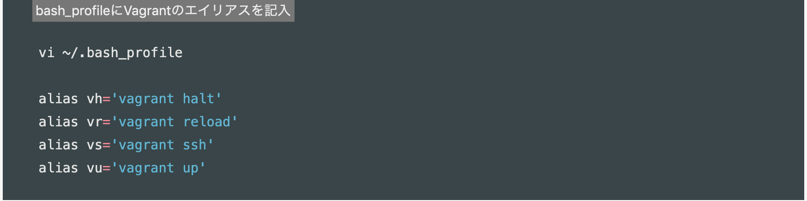

# vagrant + virtual boxによる環境構築

>## `bundle install`時の注意事項
1. `therubyracer`のインストールでエラーが起こる場合
  - `sudo yum install gcc-c++`を行う

>## 接続手順
1. `vagrant up`: サーバ立ち上げ
1. `vagrant ssh`: 仮想サーバにssh接続
1. `vagrant halt`: 仮想サーバの停止（pcシャットダウン前に必ずやること）
1. `vagrant reload`: `Vagrantfile`の再読み込み

>## ローカルサーバの立ち上げ
`rails server -b 0.0.0.0`にて立ち上げ、`http://localhost:3000`にアクセス

>## 共有フォルダの位置
centOS:`/vagrant_data`とMac:`~/centos7/data`がそれぞれ共有フォルダに当たる

>## 用語集
1. `ドキュメントルート`：webサーバやftpサーバが外部に公開するファイルなどを置いたディレクトリのこと
    - centOSでは`/var/www/html`に当たる

>## Mac側のエイリアス
1. vagrant関連のエイリアス

>## Linuxコマンド集
1. `ifconfig`: IPアドレスを表示
